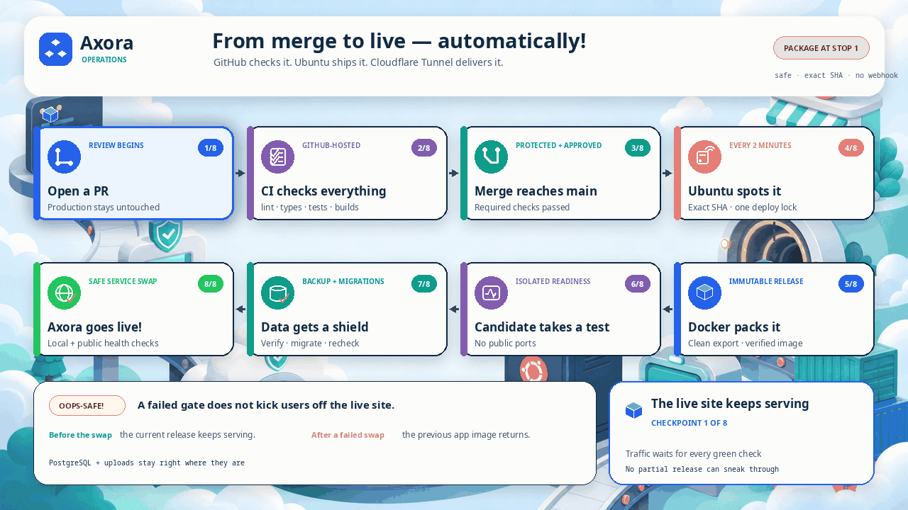

# Axora procurement

Axora is a self-hosted, secure multi-company procurement platform. It gives
company requesters and approvers, Axora Agents, HR Management, and Delivery Guys,
Human Resources Management users, Client Account Managers, and Delivery Guys focused workspaces
while preserving one tenant-scoped, append-only lifecycle from need through
payment, fulfilment, receipt, invoice, and delivery evidence.


## Production migration

The controlled migration from Render to the local Ubuntu server is documented
here:

- [Production architecture](docs/PRODUCTION_ARCHITECTURE.md)
- [Migration plan, risks, and rollback](docs/MIGRATION_PLAN.md)
- [Production runbook](docs/PRODUCTION_RUNBOOK.md)
- [Disaster recovery](docs/DISASTER_RECOVERY.md)

These documents are preparation assets, not evidence of a completed cutover.
Render must remain available until the public domain, restart recovery,
automatic deployment, backups, and rollback have all been verified and an
authorized Axora platform owner explicitly approves decommissioning.

## What is ready now

- Localized public Axora website plus responsive role-specific portals.
- Top application navigation with a permission-aware drawer, profile,
  notifications, and language control; no permanent left sidebar.
- Canonical account/role/scope assignments, one-time invitations, Argon2id
  passwords, live sessions, profile onboarding, and localized role guidance.
- Routine authenticated work uses the live session, explicit permission,
  tenant scope, CSRF and audited database boundaries without a disruptive
  second password prompt. Credential changes still verify the current password.
- Safe non-secret portal form fields autosave in a user-, scope-, route- and
  form-specific browser-session draft. Refresh and route recovery restore the
  draft; passwords, tokens, secrets and file contents are never persisted.
- Automatically derived accessible company branding from validated logos;
  company users receive no color/theme editor.
- Global catalogue management, Delivery Guy execution, and independent receiver
  flows, invoice reconciliation, workflow timelines, and in-app/email
  outboxes. Axora has no supplier account or supplier-facing portal.
- Optional sanitized demonstration data for isolated local development only.
- PostgreSQL 18 forward migrations through `076`, guarded
  workflow transitions, financial views, audit triggers, relationship
  constraints, and optional development seed. Production never seeds a demo
  account or default password. This target is not evidence that production has
  advanced beyond its separately audited migration state.
- Technical-support diagnostics use narrow database capabilities: the
  application role cannot insert arbitrary audit rows or read private support
  source tables.
- Session revocation is audited by a database trigger that records only the
  bounded revocation transition, without exposing credential-adjacent session
  fields or granting the application role direct audit-table writes.
- Docker Compose production override with private database/application/edge
  networks, loopback diagnostics, Caddy, and a dedicated Cloudflare Tunnel.
- Exact-commit deployment, migration locking, health, verified backup,
  rollback, and systemd scheduling assets for the Ubuntu server.
- Automated lint, TypeScript, database, seed, formula, and workflow checks.

Refactor architecture and operating decisions are documented in:

- [Product and data architecture](docs/refactor/ARCHITECTURE.md)
- [Role and scope matrix](docs/refactor/ROLE_MATRIX.md)
- [Security baseline](docs/refactor/SECURITY_BASELINE.md)
- [Migration and guarded reset plan](docs/refactor/MIGRATION_AND_RESET_PLAN.md)
- [Workbook import report](docs/refactor/WORKBOOK_IMPORT_REPORT.md)
- [Transactional email runbook](docs/ACCOUNT_EMAILS.md)
- [Email provider and DNS gates](docs/refactor/EMAIL_PROVIDER_AND_DNS.md)
- [Email provider events and suppression](docs/refactor/EMAIL_PROVIDER_EVENTS.md)

## Try it on this Windows PC

This section is for an isolated development environment. Production always
runs with `DEMO_MODE=false` and the PostgreSQL production data.

Open PowerShell in this folder and run:

```powershell
powershell -ExecutionPolicy Bypass -File .\scripts\windows\start-demo.ps1
```

Then open <http://localhost:3000>. The local sign-in values are stored only in
`.env.local`. Stopping the development server resets demonstration changes.

## Ubuntu production server

The Ubuntu server, Docker services, PostgreSQL volume, and hybrid data are
already present at `/srv/axora`. Do not use the older LAN-only setup commands
for the Render migration. Follow the staged
[production runbook](docs/PRODUCTION_RUNBOOK.md); it keeps Render available
until the local application, apex Tunnel, automatic deployment, backup,
restart, and rollback gates have been proved.

## Automatic deployment flow



Protected `main` changes pass GitHub verification before the Ubuntu deployment
manager backs up production, deploys the exact approved commit, runs migrations
and health checks, and keeps rollback available.

## Payment and invoice rule

Axora does not use Cash on Delivery.

An authorised customer selects **Pay** after approval. Axora recalculates the
approved server-side snapshot, records the payment as paid, finalizes one
permanent invoice, generates its PDF, and queues one invoice email with the PDF
attached. Customers are not shown an implementation strategy or provider.

The current testing-stage strategy does not use an online gateway. It is
isolated behind the payment-completion boundary so a future verified provider
or reviewed administrator-confirmed flow can replace it without changing invoice,
document, email, fulfilment, or delivery semantics. Follow
[PAYMENT_AND_INVOICE_OPERATING_RULES.md](PAYMENT_AND_INVOICE_OPERATING_RULES.md).

## Verification

```bash
npm ci
npm run verify
scripts/production/validate-assets.sh
```

Docker, Compose, Caddy, migration, and Tunnel validation is performed on the
Ubuntu server as described in the production runbook.

## Important safeguards

- Never publish PostgreSQL port `5432` or Next.js port `3000` to the LAN.
- Never configure router port forwarding for Axora.
- Never run `docker compose down -v` during normal operation; `-v` deletes data
  volumes.
- Keep delivery fees separate from sales and margin until Finance approves the
  accounting treatment.
- Keep payment, invoice, email delivery, fulfilment, and physical delivery as
  independent auditable states.
- A backup on the same SSD is not sufficient; copy verified backup folders to a
  separate USB drive or NAS.
  See `THIRD_PARTY_NOTICES.md`.

## Checkout, payment, and invoices

Axora's customer checkout presents one clear **Pay** action. During the current
testing stage, the server recalculates the immutable approved total, records the
payment as paid, finalizes a permanent invoice, generates its PDF, and queues one
polished transactional email with that PDF attached through Resend.

Payment and physical delivery are independent states. Fulfilment, delivery
tracking, and customer receipt continue through their own state machines after
payment. The internal payment-completion boundary is replaceable: a future bank,
card, FPX, or reviewed administrator-confirmed integration can produce the same
trusted paid event without rewriting invoice finalization or email delivery.

### Effective access, scoped administration, and saved progress

Axora authorizes each account with a live effective-access model: a role supplies
reviewed defaults, explicit grants and denies tailor those defaults, scope limits
where they apply, and approval limits remain separate financial authority. User
creation and access editing expose grouped permission checkboxes; non-owner
administrators can delegate only permissions they possess.

Axora-internal user administration, customer-company user administration, and
delivery-user administration are independent permissions. Creating or managing
customer users never grants authority to create Axora employees. Customer
companies are visible to the Platform Owner, explicitly assigned account
managers, and users inside their own authorized company scope. An assigned
administrator cannot enumerate another manager's companies through portal pages,
APIs, analytics, exports, or generated-document capabilities. Revenue, profit,
buying cost, pricing, and company budgets are independently permissioned, and
restricted commercial fields are redacted by PostgreSQL before they reach the
application.

Routine authenticated portal work does not require a second password challenge.
Login, live session validation, CSRF protection, permission checks, RLS, tenant
scope, password-change verification, and audit evidence remain enforced. Safe
portal form fields are autosaved in session-scoped browser storage and restored
after refresh or route recovery. Draft keys include the signed-in user, tenant
scope, route, form identifier, and schema version; drafts expire, can be
discarded, and never persist passwords, tokens, credentials, payment secrets, or
file contents.
## Simplified operating model

Current work follows `NEW -> ASSIGNED -> CONTACTED -> QUALIFIED -> ONBOARDING -> ACTIVE`.
Human Resources Management assigns leads to Client Account Managers (Agents).
An assigned Client Account Manager prepares the customer-company record and
submits it for verification. Only the Platform Owner can approve, reject, or
request changes. A submitted company cannot become active or open its portal
until the owner has verified it; rejected and change-requested records remain
available to the assigned Manager for correction and audited resubmission.
Agents can see only assigned leads and companies; the Platform Owner retains
global visibility but does not perform lead or company assignment. Customer
approval remains tenant-owned and always prevents self-approval.

The active purchase path is:

`Request -> Company approval -> Pay -> Invoice -> Prepare -> Delivery -> proof of receipt -> Completed`

The catalogue no longer exposes supplier ordering rules, minimum or maximum
quantities, increments, pack units, rule reasons, or effective dates. Historical
columns and sourcing evidence remain preserved for audit and rollback, but new
application behavior does not use the retired workflow.

`Pay` is server-authoritative and idempotent. It commits the approved budget,
records payment once, finalizes one permanent invoice, generates one PDF, and
queues one invoice email. Payment and delivery states remain independent.

Safe form drafts remain scoped to the authenticated user, role assignment,
tenant and route. Draft restoration is silent; passwords, tokens, secrets and
file contents are never persisted.
# Immersive World V2

Axora's public experience uses six route-specific, progressively enhanced 3D scenes. The customer-visible lifecycle is `Request -> Approve -> Pay -> Invoice -> Prepare -> Deliver -> Track -> Complete`; internal buying activity, supplier identity, private cost and driver operational notes never cross the customer boundary. Licensed semantic GLB models and interface sounds are self-hosted and inventoried in `THIRD_PARTY_ASSETS.md`.

Aurora, Solar, Ember and Midnight are public and internal-staff atmosphere choices. Customer-company portals always use the reviewed logo-derived company theme, which takes precedence over any pre-login choice. Sound is muted by default. Reduced-motion, reduced-data, WebGL failure and context loss retain complete semantic HTML fallbacks.

Paid requests enter an available delivery-job pool. Active Delivery Guys claim work atomically; Platform Owners monitor drivers and may only release a genuinely stuck job through an audited recovery action. Driver location requires explicit browser permission, is collected only for active work, and is exposed to customers only as privacy-safe status and ETA.

The controlled three-company MVP uses a bounded, self-hosted Klang Valley street map and the explicit `mvp-conservative` retention mode. Protected financial, delivery, proof, security and audit evidence is access-revoked and retained without automatic purge; broader map coverage and a general-availability retention review remain post-pilot decisions.

Platform Owners do not administer customer budgets. Company and branch budget validation remains company-scoped. Creation routes are separated from collection routes for companies, users, products and branches.
