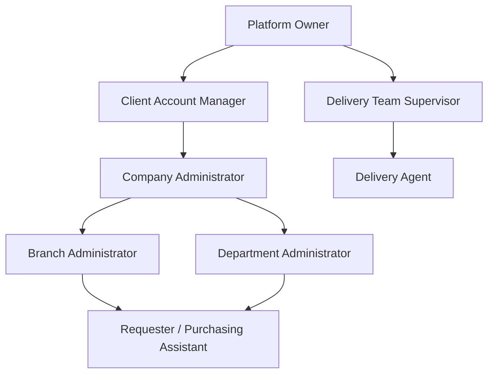

# Axora P0-01 authorization policy foundation

Status: implemented as an expand-compatible foundation. See [Live effective-access runtime](EFFECTIVE_ACCESS_RUNTIME.md) for the authenticated request integration.

This document complements `ROLE_MATRIX.md`. Runtime authorization remains deny-by
default and is the intersection of account state, role, explicit permission,
scope, approval limit, self-approval policy, budget, company ceiling, resource
ownership, and current workflow state.

## Canonical management hierarchy

Specialist roles such as Company Approver, Branch Approver, Finance Reviewer,
Auditor, Receiving User, Supplier User, Platform Operations, and Technical
Support remain available where separation of duties requires them. They are not
implicit powers inherited from a person's job title.

## Authorization decision order

```mermaid
flowchart LR
  A[Active account and live session]
  B[Known role and account kind]
  C[Active direct or delegated scopes]
  D[Role defaults plus explicit grants]
  E[Explicit deny]
  F[Resource ownership and workflow state]
  G[Self-approval permission]
  H[Approval limit and currency]
  I[Available virtual budget]
  J[Company contractual ceiling]
  K[Allow]

  A --> B --> C --> D --> E --> F --> G --> H --> I --> J --> K
```

Any failed stage denies the operation. An explicit deny wins over a role default,
explicit grant, or delegation. UI visibility is never accepted as authorization.

## Stable permission codes

`src/lib/authorization-policy.ts` is the executable TypeScript catalogue.
Migration `036_authorization_policy_foundation.sql` stores the same dot-delimited
codes in PostgreSQL. Existing snake_case permission checks remain a compatibility
surface while routes are migrated; new work must use canonical codes such as:

- `request.create`
- `request.approve.other`
- `request.approve.self`
- `budget.increase`
- `commercial.company_ceiling.override`
- `delivery.assign`
- `document.dispatch.supplier`
- `analytics.platform.view`

## Role versus job title

A role and permission set controls authorization. `job_title` remains profile
information only. Text such as “HR Manager”, “Sales Manager”, or “Finance
Manager” must never grant an operation.

## Scope model

| Scope | Required identity | Contains |
| --- | --- | --- |
| `PLATFORM` | Platform account and platform role | All resource scopes, only for permissions the role actually has |
| `COMPANY` | Company membership or assigned client-company coverage | The same company and its branch/department resources |
| `BRANCH` | Same company plus active branch assignment | The same branch and its resources |
| `DEPARTMENT` | Same company plus active department assignment | The same department only |
| `SUPPLIER` | Active supplier membership | Work assigned to that supplier |
| `DELIVERY` | Active delivery account | General supervised delivery scope or one assigned delivery |

Client Account Managers are platform accounts with explicit company scopes. A
platform account does not gain global company access merely because it is an
Axora employee.

## Explicit permissions and delegations

The foundation schema adds:

- `permissions`
- `role_permissions`
- `user_permission_overrides`
- `user_scopes`
- `approval_limits`
- `delegated_access`
- `delegated_access_permissions`
- `delegated_access_scopes`
- `permission_change_history`

Delegations are bounded by start/end time, explicit permissions, explicit scopes,
and an authorizing actor. They cannot outlive their recorded period. Services
that create a grant must separately prove that the authorizer possesses and may
delegate every granted permission.

## Approval controls

Approval is never implied by request creation. The policy evaluates:

1. `request.approve.other`;
2. `request.approve.self` when requester and approver are the same user;
3. a matching active approval limit;
4. the exact currency;
5. available virtual budget or an explicit over-budget permission;
6. the company ceiling or an explicit Axora-level ceiling override;
7. current request version and workflow state in the domain service.

## Persistence and audit

Migration 036 is forward-only and non-destructive. Existing users, assignments,
roles, sessions, companies, and historical records are preserved. Existing role
assignments are copied into `user_scopes` as compatibility references.

`permission_change_history` is append-only. Application services must record
role, scope, permission, approval-limit, and delegation changes with actor,
reason, previous/new safe values, time, and correlation ID. Secrets and
credentials are prohibited from these records.

## Rollout sequence inside P0-01

1. Catalogue, evaluator, schema, role vocabulary, and tests.
2. Load explicit grants, limits, scopes, and delegations into authenticated
   authorization context.
3. Migrate protected operations from legacy permission names to canonical codes.
4. Add the effective-access editor and read-only matrix.
5. Remove compatibility paths only after all routes and background jobs use the
   canonical authorization service.
